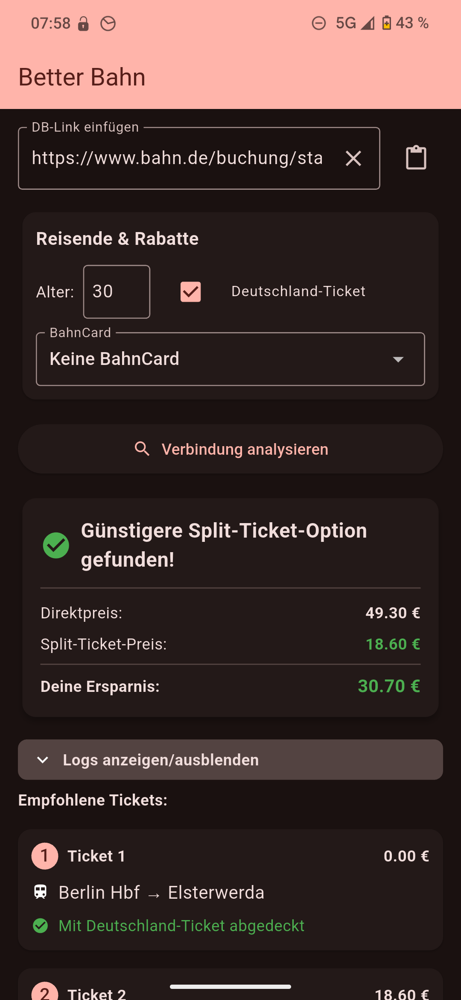
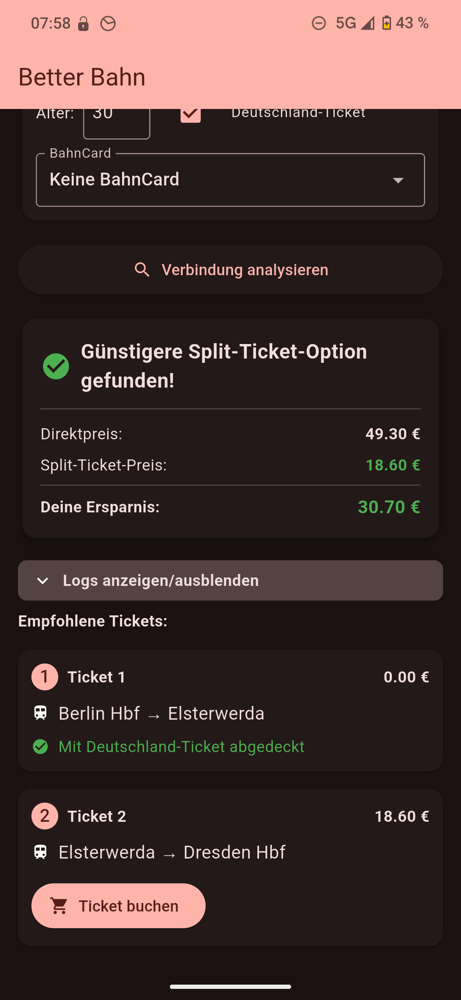

# Better Bahn
<p align="center">
  
</p>

Eine App zum Finden günstigerer Split-Ticket-Optionen für Deutsche Bahn Verbindungen.


## Funktionen

- Analyse von DB-Links (kurze vbid-Links und lange URLs)
- Finden der günstigsten Split-Ticket-Kombination
- Unterstützung für BahnCard-Rabatte (25/50, 1./2. Klasse)
- Deutschland-Ticket-Integration
- Direkte Buchungslinks für gefundene Tickets (Das oberste Angebot ist das richtige)
- Detaillierte Preisvergleiche und Ersparnisberechnung
- **Keine Serverkosten: Die App läuft vollständig lokal auf Ihrem Gerät.**

## Screenshots

<p align="center">
  
  
</p>

## Installation

### Android
Gehen Sie zur [Releases-Seite](https://github.com/chukfinley/Better-Bahn/releases) und laden Sie die neueste Version herunter.

### iOS
Ich selbst besitze weder einen Mac noch ein iOS-Gerät, um die App für iOS zu kompilieren. Sollte jemand von euch die App erfolgreich für iOS kompilieren können, meldet euch gerne bei mir, und ich werde die iOS-Version dann offiziell hier bereitstellen.

## Development

### Building the app

1. Stelle sicher, dass Flutter auf deinem System installiert ist
2. Klone das Repository:
   ```
   git clone https://github.com/chukfinley/Better-Bahn
   ```
3. Wechsle in das Verzeichnis:
   ```
   cd better-bahn/flutter-app
   ```
4. Installiere die Abhängigkeiten:
   ```
   flutter pub get
   ```
5. Starte die App:
   ```
   flutter run
   ```

### Python-Version

Die App ist auch als Python-Skript verfügbar:

1. Stelle sicher, dass `uv` installiert ist
2. Installiere die Abhängigkeiten:
   ```
   uv run main.py
   ```
3. Führe das Skript aus:
   ```
   uv run main.py "https://www.bahn.de/buchung/start?vbid=9dd9db26-4ffc-411c-b79c-e82bf5338989" [--age 30] [--bahncard BC25_2] [--deutschland-ticket]
   ```

## Verwendung

1. Kopiere einen Link aus der DB Navigator App oder von bahn.de
2. Füge den Link in die App ein
3. Wähle optional deine BahnCard und andere Einstellungen
4. Klicke auf "Verbindung analysieren"
5. Die App zeigt dir, ob eine günstigere Split-Ticket-Option verfügbar ist
6. Nutze die Buchungslinks, um die einzelnen Tickets direkt zu kaufen

## Unterstützte Links

- Kurze Links: `https://www.bahn.de/buchung/start?vbid=...`
- Lange Links: `https://www.bahn.de/...#soid=...&zoid=...&hd=...`

## Wie es funktioniert

Die App analysiert alle möglichen Teilstrecken einer Verbindung und findet durch dynamische Programmierung die günstigste Kombination von Tickets, die die gesamte Strecke abdeckt. Dabei werden auch Rabatte durch BahnCard und Deutschland-Ticket berücksichtigt.

**Wichtiger Hinweis zur Funktionsweise:**
Diese App nutzt **keine offizielle API** der Deutschen Bahn. Stattdessen simuliert sie die Abfragen, die ein Browser an `bahn.de` senden würde, um die nötigen Fahrplandaten und Preise zu erhalten. Da für die Analyse vieler möglicher Teilstrecken eine große Anzahl von Anfragen notwendig ist, würde ein zentraler Server (z.B. eine Webseite) sehr schnell von der Deutschen Bahn blockiert werden. Um dies zu vermeiden, sendet **jede Installation der App die Anfragen direkt von Ihrem Gerät**. Dadurch verteilt sich die Last auf viele individuelle Nutzer, und die Funktionalität kann erhalten bleiben. Es gibt daher auch keine Webseiten-Version dieser App.

## To-Do-Liste

- [ ] Logo zur Android-App hinzufügen

## Beitragen

Beiträge sind willkommen! Bitte öffne ein Issue oder einen Pull Request, wenn du Verbesserungen vorschlagen möchtest.

## Lizenz

Dieses Projekt ist unter der DO WHAT THE FUCK YOU WANT TO PUBLIC LICENSE lizenziert - siehe die [LICENSE](LICENSE.txt) Datei für Details.

## Haftungsausschluss

Diese App ist ein inoffizielles Projekt und steht in keiner Verbindung zur Deutschen Bahn AG. Die Nutzung erfolgt auf eigene Gefahr. Die gefundenen Split-Tickets entsprechen den Beförderungsbedingungen der Deutschen Bahn.

## Danksagung

Ein großer Dank geht an Lukas Weihrauch und sein Video, das die Inspiration für dieses Projekt lieferte: [https://youtu.be/SxKtI8f5QTU](https://youtu.be/SxKtI8f5QTU)